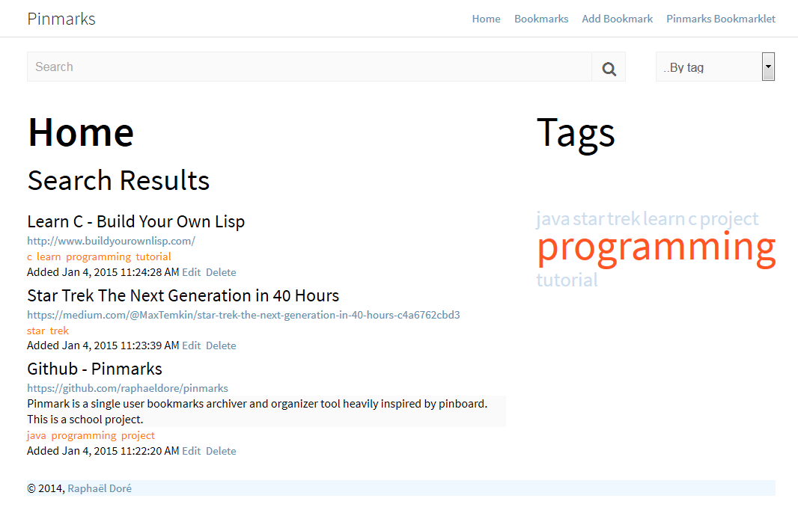

pinmarks
========

Pinmark is a single user bookmarks archiver and organizer tool heavily inspired by pinboard. This is a school project. I am aware that my tests need improvements.

The rest of the documentation is in french, sorry!

## Comment importer mon projet dans Eclipse
Puisque j’utilise Maven, il faut, à partir d’Eclipse (ou IntelliJ), importer le projet maven (Dans Eclipse : `file → Import → Maven → Existing Maven Project`). Ensuite il faut attendre quelques minutes que toutes les dépendances du projet soient téléchargées. En théorie c’est tout ce qu’il y a comme préparations. Si jamais ça ne fonctionne pas, voir l’exemple dans la documentation Dropwizard : [http://dropwizard.io/manual/example.html](http://dropwizard.io/manual/example.html)

### Comment démarrer le projet à partir d’Eclipse
Normalement, une fois le projet importer dans Eclipse, il devrait y avoir dans le root du projet, parmi les autres fichiers, deux fichiers très importants :
* Migrate Pinmarks DB.launch
* Run Pinmarks.launch

Ces deux fichiers définissent le point d’entrée de l’application, et ajoutent les arguments nécessaires que la classe Main utilise pour déterminer le mode de l’application.

#### Migrate Pinmarks DB.launch
Avant de démarrer le projet, pour ne pas avoir des centaines d’erreurs de connections à la base de données, il faut créer la base de données. Tout ce que ce fichier fait c’est appeler la fonction Main de l’application avec les options migrate db pinmarks.yml. Dropwizard va ainsi automatiquement rechercher pour un fichier migrate.xml dans le dossier `/src/main/java/resources/` et va l’envoyer au framework Liquibase. `Migrate.xml` est une représentation XML de ma base de données. Liquibase est utilisé pour convertir cette représentation en format que ma base de données comprend (Plus d’infos sur Wikipedia… Le site de Liquibase n’explique pas super bien le but du framework).

Donc, pour migrer la base de données, il faut faire clic droit sur le fichier à partir du package explorer et faire : `Run as → Run as Migrate Pinmarks DB`. Il est aussi fort probable que Migrate Pinmarks DB se retrouve dans les launch configurations d’Eclipse.

#### Run Pinmarks.launch
Une fois la base de données crée, il est possible de démarrer l’application à partir d’eclipse. C’est ce que le fichier Run Pinmarks.launch permet de faire. On appelle la fonction `Main` de l’application avec les paramètres server pinmarks.yml, et comme par magie, on a une instance Jetty avec notre application qui roule en arrière-plan.
L’adresse de l’application est : [http://localhost :8080/](http://localhost :8080/)

## À partir de la ligne de commande
Si vous avez maven d’installer (pas juste dans Eclipse, mais que vous avez maven parmis vos programmes), et que l’exécutable maven est accessible à partir de n’importe où (c’est-à-dire qu’il est dans le path), vous pouvez facilement compiler l’application.

Après avoir cloner ce projet, pour satisfaire toutes les dépendances de l’application : `mvn dependency:resolve`

Ensuite, pour compiler le programme et exécuter automatiquement les tests (Si un test ne passe pas, la commande ne fonctionnera pas) : `mvn exec`

Dans le dossier target/ il y a maintenant un fichier .jar intitulé `pinmarks-0.0.1-SNAPSHOT.jar`. C’est mon application. À partir du dossier racine, exécutez les commandes suivantes :

Pour créer la base de données : `java –jar target/pinmarks-0.0.1-SNAPSHOT.jar migrate db pinmarks.yml`

Pour démarrer l’application, vous avez le choix entre :
	
    mvn exec : java

Ou bien :
	
    java – jar target/pinmarks-0.0.1-SNAPSHOT.jar server pinmarks.yml

C'est pas mal tout.
